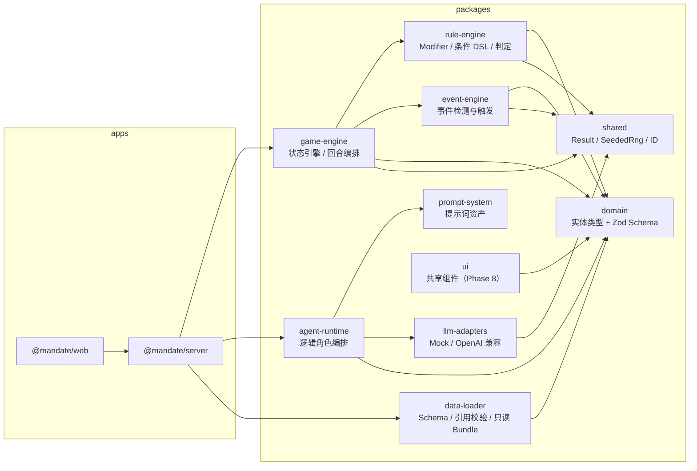
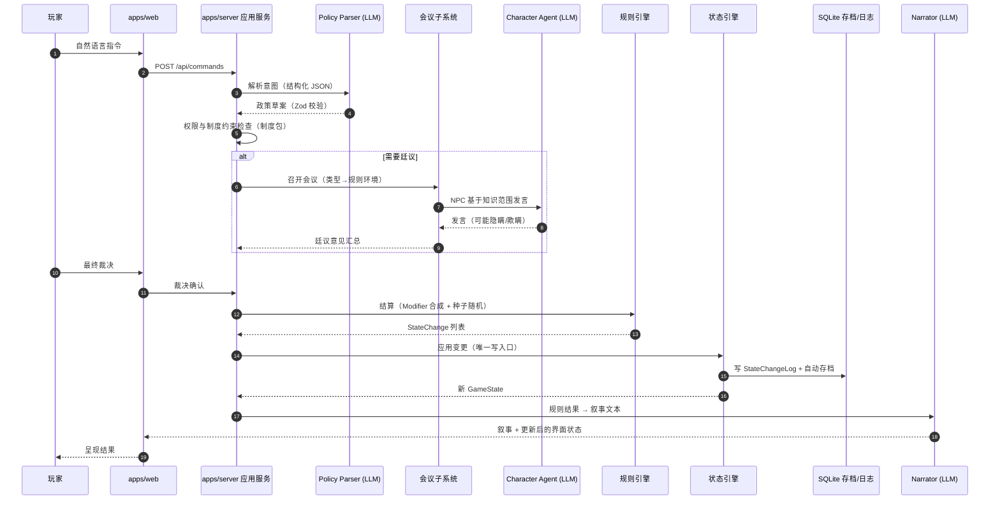
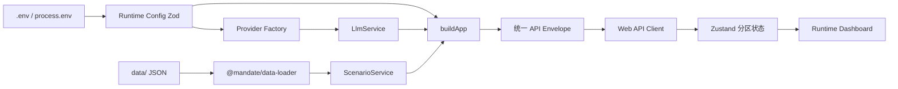
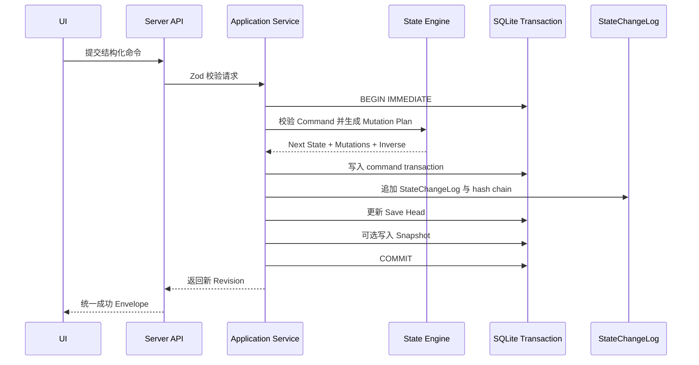
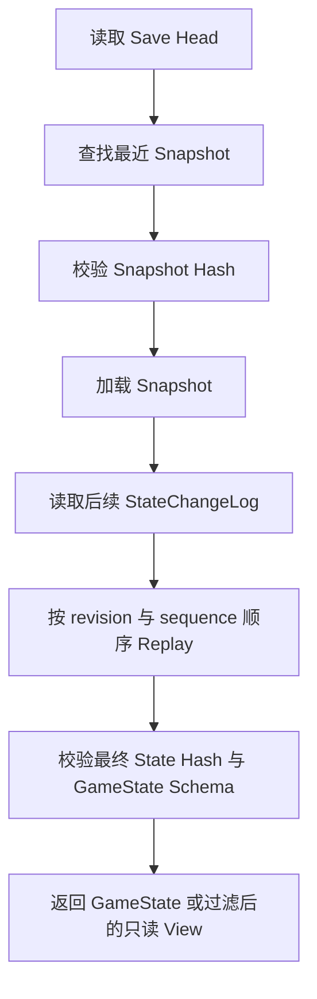
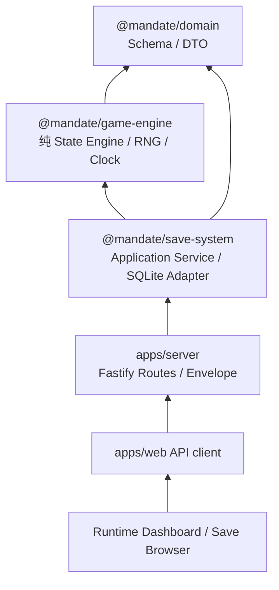
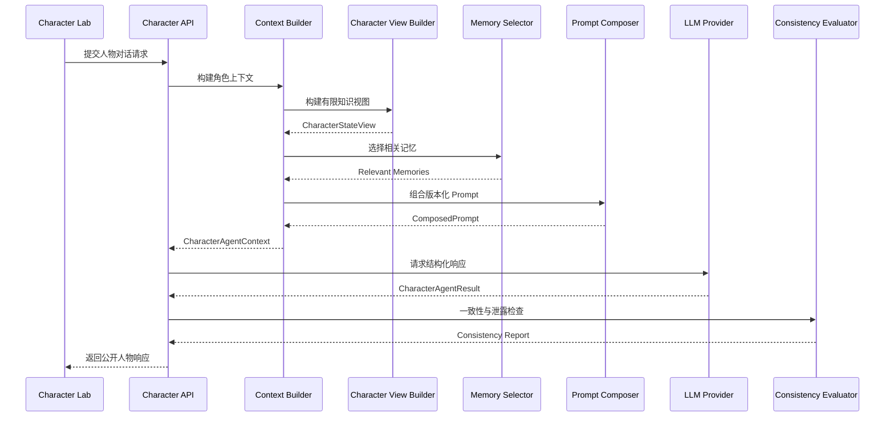
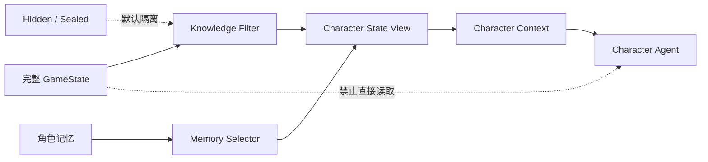

# 02 · 系统架构

## 1. 架构总览

本项目采用**模块化单体 + 前后端分离**架构（见 ADR-001）：

- `apps/web`：浏览器客户端（表现层）；
- `apps/server`：单一 Node 服务端进程，承载应用服务、Agent 编排、规则/事件/状态引擎、数据访问；
- `packages/*`：按职责拆分的内部库，通过 npm workspaces 组织；
- `data/`：历史模板数据（只读、版本控制）；
- `packages/data-loader`：模板 Schema、引用完整性、只读 Bundle 与进程缓存；
- SQLite（node:sqlite）：存档与状态变更日志（运行时数据）。

## 2. 系统上下文图

## 3. 模块关系图

依赖规则：

- `domain` 与 `shared` 不依赖任何其他内部包；
- `game-engine`、`rule-engine`、`event-engine` **禁止**依赖 `llm-adapters` 与 `agent-runtime`（核心计算必须脱离 LLM 可测试）；
- `agent-runtime` 可以调用引擎读取状态，但**不能**直接写状态；
- 只有 `game-engine`（状态引擎）拥有状态写入入口。

## 4. 一次完整回合的调用链

**规则优先，叙事后置**：步骤 7–10 完成全部数值结算与状态落盘之后，才进行步骤 11 的叙事生成。
任何模块不得根据叙事文本反向修改数值。

## 5. LLM 与规则引擎的责任边界

| 职责                               | LLM（Agent 层）         | 规则引擎          |
| ---------------------------------- | ----------------------- | ----------------- |
| 人物发言、政治辩论、奏折文本       | ✅ 生成                 | ❌                |
| 政策草案结构化（从自然语言）       | ✅ 生成草案（须经校验） | ✅ 校验与约束检查 |
| 国库/人口/粮食/军队数值            | ❌ 禁止                 | ✅                |
| 战争与灾害结果                     | ❌ 禁止                 | ✅                |
| 忠诚/态度/派系力量变化             | ❌ 禁止                 | ✅                |
| 腐败、行政效率、民心               | ❌ 禁止                 | ✅                |
| 泄密/叛乱等概率判定                | ❌ 禁止                 | ✅（种子随机）    |
| 叙事文本（规则结果的自然语言表达） | ✅                      | 提供结果数据      |
| 史实测注与来源标注建议             | ✅ 建议                 | ✅ 强制字段校验   |

约束机制：

1. LLM 的一切结构化输出经 Zod Schema 校验，失败重试、再失败降级（ADR-002）；
2. Agent 层没有状态写入 API，只能提交"建议/草案/文本"；
3. 提供给 LLM 的状态视图按角色过滤（FR-STATE-003、FR-CHAR-002）；
4. Prompt 文本不被当作系统指令执行；LLM 不得执行代码、访问文件。

## 6. 前端与后端边界

- Phase 1 通信：HTTP JSON，已提供 health、version、runtime config 与 scenario metadata；
  `POST /api/commands`、`GET /api/state` 和 SSE 留待后续阶段；
- 契约：请求/响应 DTO 的 Zod Schema 放在 `packages/domain`，前后端共享，避免双写漂移；
- Envelope：成功 `{ok:true,data,meta:{requestId}}`，错误 `{ok:false,error,meta:{requestId}}`；
- Web 只经统一 API Client 发请求，集中处理超时、取消、非 2xx、Envelope 与响应 Schema；
- 前端只做呈现与输入，不保存游戏逻辑真相；刷新页面后从后端恢复全部状态；
- 开发环境通过 Vite proxy 将 `/api` 转发至 `127.0.0.1:3000`，无需 CORS。

## 7. 状态修改流程

要点：

- **唯一写入口**：状态引擎是唯一可以修改 GameState 的模块；
- **日志只增不改**：StateChangeLog 是审计与回放的基础，永不更新、永不删除；
- **事件连锁有界**：事件触发事件的递归深度设上限（初值 8），防止死循环。

## 8. 三种会议作为规则环境

会议类型不是聊天背景，而是参数化规则环境（`MeetingRules`，见 `packages/domain`）。
初值如下（Phase 9 统一平衡性调优）：

| 维度           | 朝会 court_assembly | 御前会议 imperial_council | 秘密议事 secret_council |
| -------------- | ------------------- | ------------------------- | ----------------------- |
| 人数上限       | 50                  | 9                         | 3                       |
| 公开性         | 公开                | 内部                      | 绝密                    |
| 正式记录       | 有                  | 有                        | 无                      |
| 泄密基准概率   | 1.0（天然公开）     | 0.3                       | 0.15                    |
| 政策合法性修正 | ×1.2                | ×1.0                      | ×0.7                    |
| 坦率基准       | 0.4                 | 0.6                       | 0.5                     |
| 政治风险基准   | 0.8                 | 0.5                       | 0.6                     |

影响面：NPC 发言意愿与真实性、信息公开程度、派系表态压力、会议记录生成、
泄密判定、政策合法性与后续执行阻力。

## 9. 朝代制度包机制

- 制度包是**数据**（`data/institutions/<dynasty>/` 等），包含：中央决策结构、官僚部门、
  监察体系、财政/军事/地方行政/选拔/继承体系、信息传递体系、特殊机构（如明代厂卫）；
- 引擎加载制度包后约束：可召开的会议类型、政策权限校验、任免流程、信息渠道；
- 新增朝代 = 新增制度包数据 + 必要的新 Modifier/事件数据，**不修改核心引擎代码**；
- 首个制度包：`ming`（明朝）。

## 10. 错误处理

| 场景                   | 策略                                                                                    |
| ---------------------- | --------------------------------------------------------------------------------------- |
| LLM 结构化输出校验失败 | 按 maxRetries 重试 → 仍失败抛 StructuredOutputError → 应用层降级（模板化回复/跳过叙事） |
| LLM 超时/网络错误      | AbortSignal 超时 + 指数退避重试 → 失败降级，不影响规则结算                              |
| 政策约束检查失败       | 返回结构化原因，玩家可修改后重试，状态不变                                              |
| 状态变更校验失败       | 中止写入、记录错误日志、状态回滚（变更整体原子）                                        |
| 存档损坏/版本不符      | 迁移失败时保留原文件、提示用户选择其他存档位                                            |
| 服务端未捕获异常       | pino 错误日志 + 500，进程不静默崩溃                                                     |
| API 路由/参数/数据错误 | 统一错误码与 requestId；响应不含堆栈、凭据或内部异常文本                                |

原则：**LLM 故障永远不阻塞规则结算**；规则结算失败必须显式报错，禁止静默吞错。

## 11. 日志系统

- 技术日志：pino（结构化 JSON），字段含 `level`、`time`、`module`、`sessionId`、`requestId`；
  级别由 `LOG_LEVEL` 控制；测试环境静默；
- 游戏日志：StateChangeLog（见领域模型），按 sessionId + turn 查询，供调试面板与回放使用；
- LLM 调用日志：provider、model、耗时与成功状态（不含 API Key、Authorization 或输入正文）；
- 日志文件位置：`logs/`（已 gitignore）；Phase 0 仅控制台输出。

## 12. 存档机制

- 存储：SQLite（node:sqlite 内置模块，见 ADR-004 与技术选型）；
- Phase 2 实际表：`saves`、`command_transactions`、`save_snapshots`、`state_change_log`、
  `schema_migrations`、`save_state_migrations`、`import_history`；详见 ADR-006。
- 快照为 Zod 校验过的 GameState JSON；加载时按 stateVersion 走前向迁移链并以 StateChangeLog replay；
- 默认每 50 revision 自动 checkpoint；手动 checkpoint 不改变世界 revision；
- 回滚采用新事务的逻辑回滚；导入分叉默认 fork，不覆盖原世界线；
- `saves/` 目录已 gitignore，测试只使用 `:memory:` 或临时目录。

## 13. 模型供应商适配

- 业务代码只依赖 `LLMProvider` 接口（`packages/llm-adapters`）：
  `generate`（文本）、`generateStructured`（Zod 校验 JSON，含重试）、
  `generateStream`（可选，Phase 4）；
- Phase 1 实现：`MockLLMProvider`（测试/离线）、`OpenAiCompatibleProvider`
  （基于内置 fetch，无 SDK 依赖，可对接 OpenAI 兼容端点与本地模型如 LM Studio/Ollama）；
- 配置驱动：`LLM_PROVIDER` / `LLM_BASE_URL` / `LLM_API_KEY` / `LLM_MODEL` 等环境变量，
  只在配置模块读取并经 Zod 校验；Server 的 Provider Factory 统一装配，路由不直接构造；
- 新增供应商 = 新增一个适配器类，业务代码零修改（ADR-005）。

## 14. 安全约束（重申）

1. LLM 输出一律视为不可信输入，结构化输出必须过 Schema；
2. LLM 不得执行任意代码、直接写库、修改游戏状态、访问未授权文件；
3. 条件 DSL 使用白名单求值器，禁止 eval / new Function；
4. API Key 只存在服务端环境变量，不下发前端；
5. Prompt 只经注册资产与显式变量渲染；其输出始终视为数据，不执行其中的代码或指令。

## 15. Phase 1 应用装配与可观测闭环

- 配置错误与默认场景错误均在监听端口前失败；
- `buildApp` 与 `listen` 分离，测试可注入 Provider、Loader、数据根目录和日志流；
- Loader 为独立包，CLI 与 Server 使用同一 Domain Schema 和引用校验；
- 历史 Bundle 深冻结，API 只投影摘要，不返回 GameState 或完整模板；
- Prompt 资产采用固定 ID 注册表和版本化 Markdown，路由中不散落 Prompt；
- CI 与本地 `npm run check` 使用 Mock Provider，默认不访问外部网络。

## 16. Phase 2 状态与存档闭环

### 16.1 状态提交时序

只有 `GameStateService → StateEngine → SqliteSaveRepository` 可以写运行时事实。Route、React、LLM、Prompt、
Rule/Event Engine 只能提交 Schema 化候选命令或 mutation，不得直接写 GameState/SQLite。

### 16.2 状态加载流程

`pre_migration` 仅作为回退备份，不参与正常 snapshot 选择。普通 API 构建 PlayerStateView，自动剥离 hidden；
CharacterStateView 只包含角色自身与基础公开事实；DebugStateView 仅供内部测试/工具。

### 16.3 Phase 2 模块依赖

`@mandate/game-engine` 不依赖 Fastify、SQLite、LLM 或 Agent；`@mandate/save-system` 是唯一 SQLite 适配层。
Web 的 Zustand 数据只是 API 派生视图，刷新后从 Server 的 GameState 恢复。

### 16.4 持久化与交换格式

- 连接：`foreign_keys=ON`、WAL、`busy_timeout=5000`、defensive mode；STRICT tables 与 prepared statements。
- 每个世界命令一个 `BEGIN IMMEDIATE` 原子事务，内部以 validate/apply/finalize SAVEPOINT 分段。
- checkpoint 不递增世界 revision；默认每 50 revision 自动创建，手动与迁移/导入备份类型独立。
- `.mesave` 使用 Backup API 生成一致 SQLite payload，ZIP 内固定 manifest/payload/checksums；可选加密与 safe-share。
- 逻辑回滚是新的 append-only 事务，不删除原 revision；分叉导入默认创建独立 save。

详细约束见 ADR-006~009 与 `docs/06-phase-2-implementation.md`。

## 17. Phase 3 人物系统与 Character Agent

### 17.1 调用链

### 17.2 信息边界

- Character Agent 无状态写权限：输出只是发言、态度、候选行动与记忆候选；
  经 State Engine 批准的行动才可能改变世界（Phase 4+）。
- 视图六级可见性（public/court/office/meeting/private/sealed）+ 认知标注
  （known/reported/suspected/inferred/outdated/contradicted）；
  hidden、他人私密数值与未参与会议绝不进入视图与 Prompt。
- 记忆经 `Agent 候选 → Schema → Memory Policy → Application Service → Repository`
  审批链落库（SQLite `character_memories`），不进 StateChangeLog。
- Agent 调用审计走结构化日志（无 Prompt 正文/密钥）；对话记录存
  `character_conversation_turns`，是交互存证而非世界事实。

详细约束见 ADR-010~014 与 `docs/07-phase-3-implementation.md`。

## 18. Phase 4 会议编排

会议编排链：Meeting State Machine（12 态全矩阵，meetingVersion 每转换 +1）→
Meeting Director（纯确定性决策：对话动作直达/七类上限/议程推进/调度选人）→
Speaker Scheduler（评分 + SeededRng tie-break）→ Character Agent（Phase 3 全链复用，
referencedTurnIds ⊆ 可见回合）→ 两阶段原子落库（阶段 A 预留 pendingAgentAction/actionId，
Provider 调用在事务外，阶段 B commitAgentTurn 幂等提交）→ 结果候选（白名单映射）→
玩家裁决 → GameCommand → StateEngine。

存储双层：GameState.meetings 只保存最小投影（meeting.* 命令更新，revision 锚点）；
富运行态/Transcript/候选/纪要/泄密评估在 SQLite migration 003 七张 STRICT 表
（append-only turns，UNIQUE(meeting_id,turn_number) + 唯一 action_id）。
会议内部推进不产生世界 revision 与 StateChangeLog；只有生命周期命令与被批准的
白名单候选经 StateEngine 变更世界。保密：秘密议事对非参与者零可见，safe_share
导出删除 sealed/private 内容；泄密为确定性评分 + 确定性 roll，触发只产生 hidden
候选事件。详见 ADR-015~021 与 docs/08-phase-4-implementation.md。

## 19. Phase 5 规则引擎与政策执行

政策链：会议候选（propose-policy 预览）或直诏 → policy.propose/approve（合法性规则，
直诏承担数据驱动代价）/issue（资格与成本预检，hidden 真实档案建档）→ time.advance
同事务结算（维持成本 → 阻力系数十项分解 → policy-resolution 规则 → 六类确定性偏差 →
阶段/终局）→ Mutation Plan 经 StateEngine 原子提交 → 明细/奏报/偏差同事务落
migration 004 三表（commitTransition.extraWrites）。

规则引擎（packages/rule-engine，纯函数，仅依赖 domain+shared）：受限条件树
（白名单路径，hidden 一律拒绝）× 八种白名单 effect；求值 priority↓+ruleId 序；
RuleTrace 全程留痕；Modifier 统一经 resolveEffectiveValue 合成
（add→mul→clamp 确定序 + 三种叠加语义 + 过期清理留痕）。随机数为派生流
（fnv1a(saveId:policyId) + tick×32），不动世界 RNG cursor——同 seed 重放与
回滚重推逐 tick 一致。

信息边界：政策运行态的进度是奏报口径（玩家可见）；真实进度/腐败/偏差在
hidden.policyTruth 与偏差流水（仅 Debug API；safe_share 全剥离）。
详见 ADR-022~026 与 docs/09-phase-5-implementation.md。
