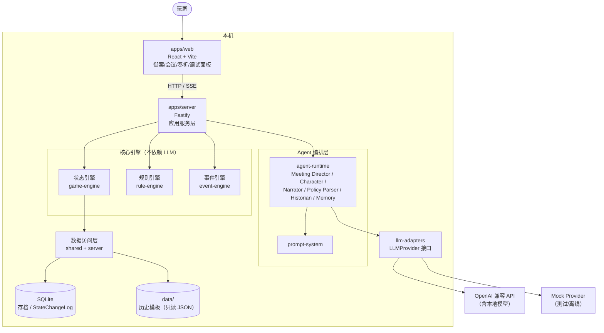
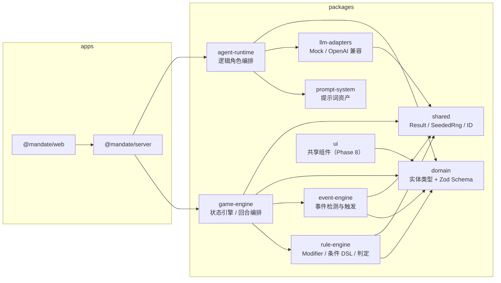
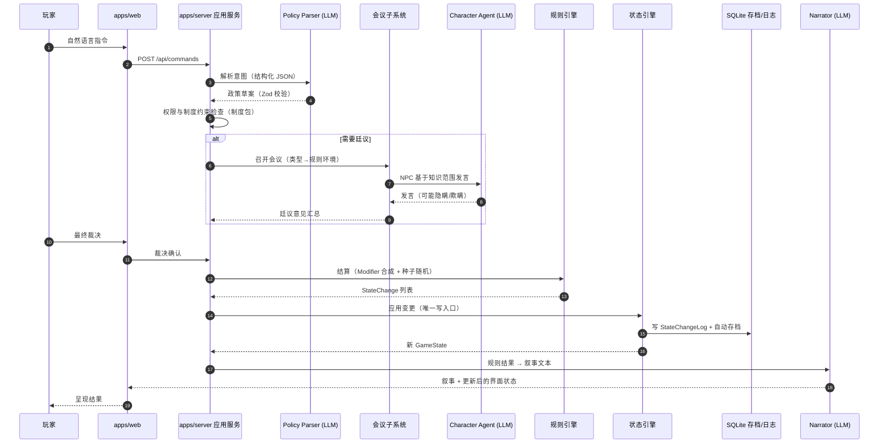
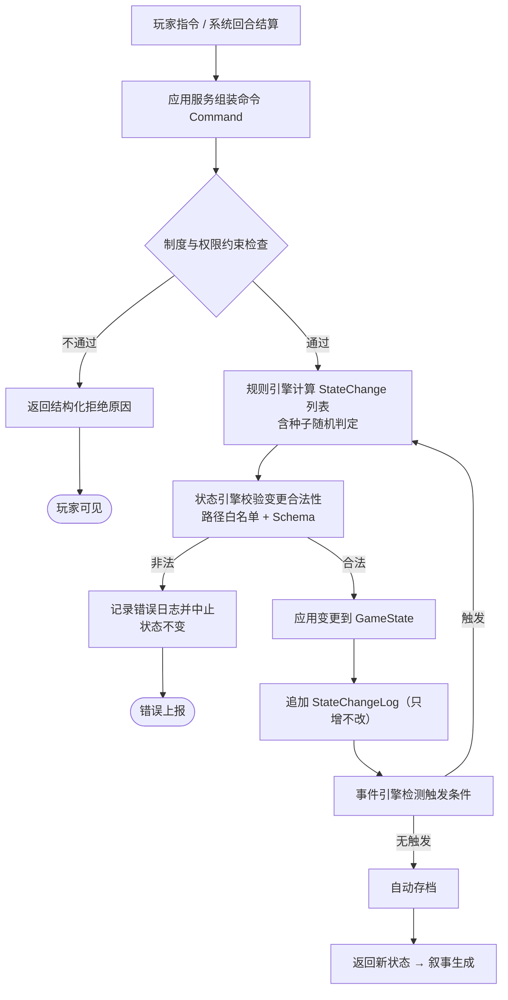

# 02 · 系统架构

## 1. 架构总览

本项目采用**模块化单体 + 前后端分离**架构（见 ADR-001）：

- `apps/web`：浏览器客户端（表现层）；
- `apps/server`：单一 Node 服务端进程，承载应用服务、Agent 编排、规则/事件/状态引擎、数据访问；
- `packages/*`：按职责拆分的内部库，通过 npm workspaces 组织；
- `data/`：历史模板数据（只读、版本控制）；
- SQLite（node:sqlite）：存档与状态变更日志（运行时数据）。

## 2. 系统上下文图

## 3. 模块关系图

依赖规则：

- `domain` 与 `shared` 不依赖任何其他内部包；
- `game-engine`、`rule-engine`、`event-engine` **禁止**依赖 `llm-adapters` 与 `agent-runtime`（核心计算必须脱离 LLM 可测试）；
- `agent-runtime` 可以调用引擎读取状态，但**不能**直接写状态；
- 只有 `game-engine`（状态引擎）拥有状态写入入口。

## 4. 一次完整回合的调用链

**规则优先，叙事后置**：步骤 7–10 完成全部数值结算与状态落盘之后，才进行步骤 11 的叙事生成。
任何模块不得根据叙事文本反向修改数值。

## 5. LLM 与规则引擎的责任边界

| 职责 | LLM（Agent 层） | 规则引擎 |
|---|---|---|
| 人物发言、政治辩论、奏折文本 | ✅ 生成 | ❌ |
| 政策草案结构化（从自然语言） | ✅ 生成草案（须经校验） | ✅ 校验与约束检查 |
| 国库/人口/粮食/军队数值 | ❌ 禁止 | ✅ |
| 战争与灾害结果 | ❌ 禁止 | ✅ |
| 忠诚/态度/派系力量变化 | ❌ 禁止 | ✅ |
| 腐败、行政效率、民心 | ❌ 禁止 | ✅ |
| 泄密/叛乱等概率判定 | ❌ 禁止 | ✅（种子随机） |
| 叙事文本（规则结果的自然语言表达） | ✅ | 提供结果数据 |
| 史实测注与来源标注建议 | ✅ 建议 | ✅ 强制字段校验 |

约束机制：

1. LLM 的一切结构化输出经 Zod Schema 校验，失败重试、再失败降级（ADR-002）；
2. Agent 层没有状态写入 API，只能提交"建议/草案/文本"；
3. 提供给 LLM 的状态视图按角色过滤（FR-STATE-003、FR-CHAR-002）；
4. Prompt 文本不被当作系统指令执行；LLM 不得执行代码、访问文件。

## 6. 前端与后端边界

- 通信：HTTP JSON（`POST /api/commands`、`GET /api/state` 等）+ SSE（Phase 4 起用于流式发言/叙事）；
- 契约：请求/响应 DTO 的 Zod Schema 放在 `packages/domain`，前后端共享，避免双写漂移；
- 前端只做呈现与输入，不保存游戏逻辑真相；刷新页面后从后端恢复全部状态；
- 开发环境通过 Vite proxy 将 `/api` 转发至 `127.0.0.1:3000`，无需 CORS。

## 7. 状态修改流程

要点：

- **唯一写入口**：状态引擎是唯一可以修改 GameState 的模块；
- **日志只增不改**：StateChangeLog 是审计与回放的基础，永不更新、永不删除；
- **事件连锁有界**：事件触发事件的递归深度设上限（初值 8），防止死循环。

## 8. 三种会议作为规则环境

会议类型不是聊天背景，而是参数化规则环境（`MeetingRules`，见 `packages/domain`）。
初值如下（Phase 9 统一平衡性调优）：

| 维度 | 朝会 court_assembly | 御前会议 imperial_council | 秘密议事 secret_council |
|---|---|---|---|
| 人数上限 | 50 | 9 | 3 |
| 公开性 | 公开 | 内部 | 绝密 |
| 正式记录 | 有 | 有 | 无 |
| 泄密基准概率 | 1.0（天然公开） | 0.3 | 0.15 |
| 政策合法性修正 | ×1.2 | ×1.0 | ×0.7 |
| 坦率基准 | 0.4 | 0.6 | 0.5 |
| 政治风险基准 | 0.8 | 0.5 | 0.6 |

影响面：NPC 发言意愿与真实性、信息公开程度、派系表态压力、会议记录生成、
泄密判定、政策合法性与后续执行阻力。

## 9. 朝代制度包机制

- 制度包是**数据**（`data/institutions/<dynasty>/` 等），包含：中央决策结构、官僚部门、
  监察体系、财政/军事/地方行政/选拔/继承体系、信息传递体系、特殊机构（如明代厂卫）；
- 引擎加载制度包后约束：可召开的会议类型、政策权限校验、任免流程、信息渠道；
- 新增朝代 = 新增制度包数据 + 必要的新 Modifier/事件数据，**不修改核心引擎代码**；
- 首个制度包：`ming`（明朝）。

## 10. 错误处理

| 场景 | 策略 |
|---|---|
| LLM 结构化输出校验失败 | 按 maxRetries 重试 → 仍失败抛 StructuredOutputError → 应用层降级（模板化回复/跳过叙事） |
| LLM 超时/网络错误 | AbortSignal 超时 + 指数退避重试 → 失败降级，不影响规则结算 |
| 政策约束检查失败 | 返回结构化原因，玩家可修改后重试，状态不变 |
| 状态变更校验失败 | 中止写入、记录错误日志、状态回滚（变更整体原子） |
| 存档损坏/版本不符 | 迁移失败时保留原文件、提示用户选择其他存档位 |
| 服务端未捕获异常 | pino 错误日志 + 500，进程不静默崩溃 |

原则：**LLM 故障永远不阻塞规则结算**；规则结算失败必须显式报错，禁止静默吞错。

## 11. 日志系统

- 技术日志：pino（结构化 JSON），字段含 `level`、`time`、`module`、`sessionId`、`requestId`；
  级别由 `LOG_LEVEL` 控制；测试环境静默；
- 游戏日志：StateChangeLog（见领域模型），按 sessionId + turn 查询，供调试面板与回放使用；
- LLM 调用日志：provider、model、token 用量、耗时、重试次数（不含 API Key）；
- 日志文件位置：`logs/`（已 gitignore）；Phase 0 仅控制台输出。

## 12. 存档机制

- 存储：SQLite（node:sqlite 内置模块，见 ADR-004 与技术选型）；
- 表设计（Phase 2 实现，此处冻结契约）：
  - `saves(slot, session_id, scenario_id, schema_version, game_date, turn, snapshot_json, created_at, updated_at)`；
  - `state_change_log(id, session_id, turn, game_date, actor, summary, changes_json, created_at)`；
- 快照为 Zod 校验过的 GameState JSON；加载时按 `schema_version` 走迁移链；
- 自动存档：每回合结算后覆盖 autosave 槽位；手动存档占用独立槽位；
- `saves/` 目录已 gitignore。

## 13. 模型供应商适配

- 业务代码只依赖 `LLMProvider` 接口（`packages/llm-adapters`）：
  `generate`（文本）、`generateStructured`（Zod 校验 JSON，含重试）、
  `generateStream`（可选，Phase 4）；
- Phase 0 实现：`MockLLMProvider`（测试/离线）、`OpenAiCompatibleProvider`
  （基于内置 fetch，无 SDK 依赖，可对接 OpenAI 兼容端点与本地模型如 LM Studio/Ollama）；
- 配置驱动：`LLM_PROVIDER` / `LLM_BASE_URL` / `LLM_API_KEY` / `LLM_MODEL` 等环境变量，
  经 Zod 校验后装配（见 `.env.example` 与 `config/llm-providers.example.json`）；
- 新增供应商 = 新增一个适配器类，业务代码零修改（ADR-005）。

## 14. 安全约束（重申）

1. LLM 输出一律视为不可信输入，结构化输出必须过 Schema；
2. LLM 不得执行任意代码、直接写库、修改游戏状态、访问未授权文件；
3. 条件 DSL 使用白名单求值器，禁止 eval / new Function；
4. API Key 只存在服务端环境变量，不下发前端；
5. Prompt 中的用户输入做转义隔离，防止把玩家输入当系统指令。
