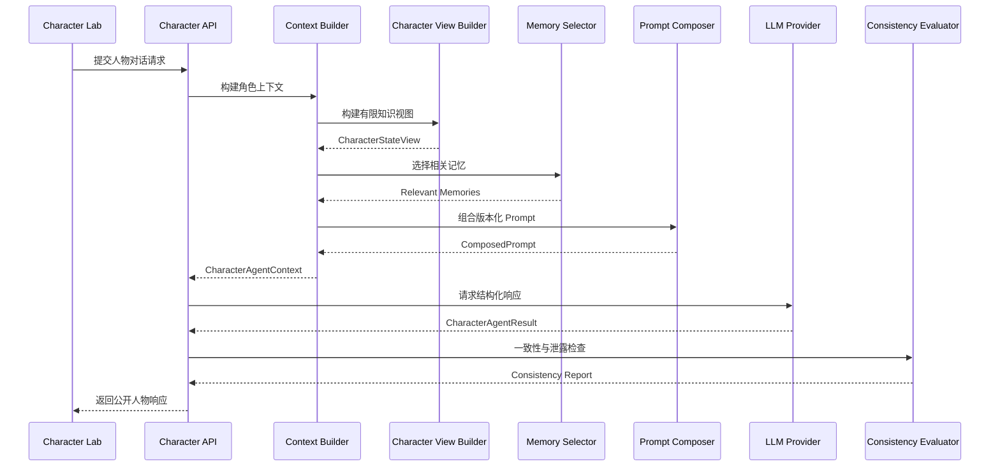
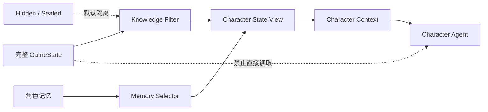
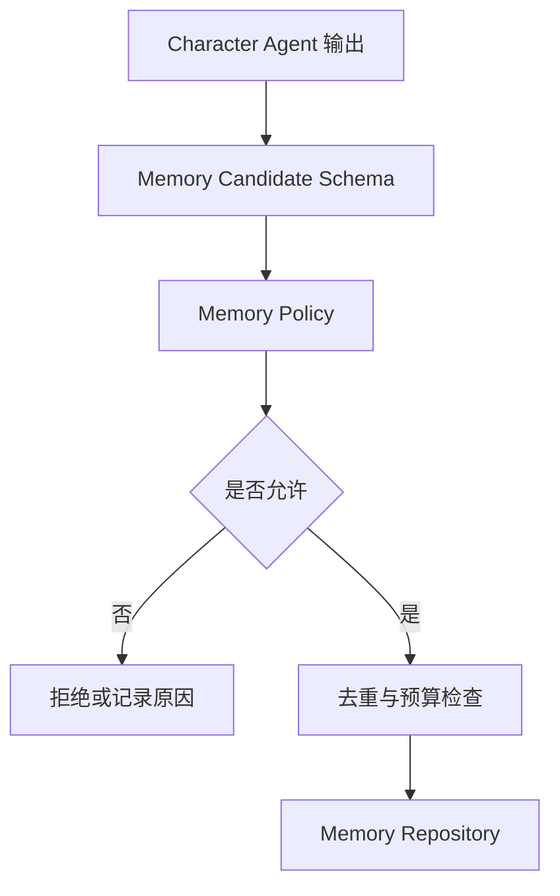

# 07 · Phase 3 实施记录：人物卡、知识视图、Prompt 资产与单人物 Character Agent

> 决策细节见 ADR-010 ~ ADR-014；验收证据见 `docs/progress/2026-07-26-phase3-session.md`
> 与 `docs/progress/phase3-benchmark.json`。

## 1. 交付范围

Phase 3 建立了可测试闭环：

```text
历史人物模板 + 当前 GameState + 角色有限知识 + 角色记忆 + 场景与谈话上下文
→ Character Context → 版本化 Prompt → Mock/真实 Provider → 结构化输出校验（含受控修复）
→ 一致性与安全检查 → 公开投影响应 + 记忆候选审批落库
→ 全程不修改 GameState、不产生 StateChangeLog
```

不包含（Phase 4+）：会议状态机、Meeting Director、多 Agent 讨论、政策解析结算、
事件引擎、向量数据库/RAG、正式游戏 UI。

## 2. 模块地图

| 层 | 位置 | 内容 |
|---|---|---|
| Domain | `packages/domain/src/character-*.ts` | 分层人物卡、知识视图、记忆、Agent 契约、人物 API Schema，12 个新错误码 |
| 数据 | `data/characters/ming/` | 魏忠贤、王承恩、黄立极、崔呈秀、袁崇焕（袁开局去职不可召对）；司礼监与 6 个官职；东林党；2 个新史料源 |
| 视图 | `packages/agent-runtime/src/visibility-policy.ts` `character-view-builder.ts` | 六级可见性 + 官职/会议/领域裁决 + 认知标注 |
| 记忆 | `packages/save-system`（migration 002 + `character-memory-repository.ts`）、`packages/agent-runtime/src/memory/` | SQLite 双表、Policy 审批、确定性 Selector、预算、规则摘要 |
| Prompt | `packages/prompt-system` | 23 个 v1 资产、manifest、budget、composer（九段固定序 + 注入中和） |
| Agent | `packages/agent-runtime/src/character-agent.ts` 等 | 编排、受控修复、确定性一致性检查、Mock Fixture |
| API | `apps/server/src/routes/characters.ts` `debug-characters.ts`、`services/character-service.ts` | 3 个公开 + 3 个 Debug 端点；Debug 生产默认 404 |
| Web | `apps/web/src/features/character-lab/` | Character Lab 调试台（存档/人物/场合/输出/Debug 折叠区） |
| 测试 | `tests/character-*.test.ts` `phase3-integration.test.ts` | 7 个新测试文件 + 既有测试更新 |

## 3. Character Agent 调用流程



## 4. 信息边界



要点：视图构建器完全不读取 `state.hidden` / `state.flags`；他人 favor/loyalty/stress、
未参与会议、未公开事件、sealed 记忆一律不可见；每条信息带 KnowledgeStatus 与可信度。

## 5. 记忆候选写入



## 6. 错误码与 API

新增错误码：CHARACTER_NOT_FOUND / CHARACTER_NOT_AVAILABLE / CHARACTER_CONTEXT_STALE /
CHARACTER_VIEW_BUILD_FAILED / CHARACTER_MEMORY_INVALID / CHARACTER_MEMORY_LIMIT_EXCEEDED /
CHARACTER_OUTPUT_INVALID / CHARACTER_CONSISTENCY_FAILED / PROMPT_ASSET_NOT_FOUND /
PROMPT_VARIABLE_MISSING / PROMPT_BUDGET_EXCEEDED / LLM_OUTPUT_REPAIR_FAILED。

| Method | Route | 说明 | Debug |
|---|---|---|---|
| GET | `/api/saves/:saveId/characters` | 运行时人物摘要（无私密数值） | 否 |
| GET | `/api/saves/:saveId/characters/:characterId` | 公开档案 | 否 |
| POST | `/api/saves/:saveId/characters/:characterId/respond` | 单人物召对（公开投影；不改状态） | 否 |
| GET | `/api/debug/saves/:saveId/characters/:characterId/context` | 知识视图/记忆选择/约束摘要 | 是 |
| GET | `/api/debug/saves/:saveId/characters/:characterId/memories` | 记忆查询（sealed 内容不返回） | 是 |
| POST | `/api/debug/saves/:saveId/characters/:characterId/respond` | 带调试信息的召对 | 是 |

## 7. 质量门

`npm run check:phase3` = check:phase2 全链 + check:characters + test:character-views +
test:character-memory + test:character-security + test:prompt-assets。
CI 全程 Mock Provider，无 Secrets、不触网。`npm run benchmark:phase3` 输出实测基准。

## 8. 已知边界

- 记忆检索为确定性规则评分，无语义向量（ADR-012 记录升级路径）。
- 跨库 `.mesave` 导入暂不迁移记忆行（存档行照常）。
- 人物关系动态演化、多人会议、发言资格与泄密判定均属 Phase 4。
- 首批人物卡文字表述待 Phase 7 史料复核；数值均为 gameplay-adjusted。
