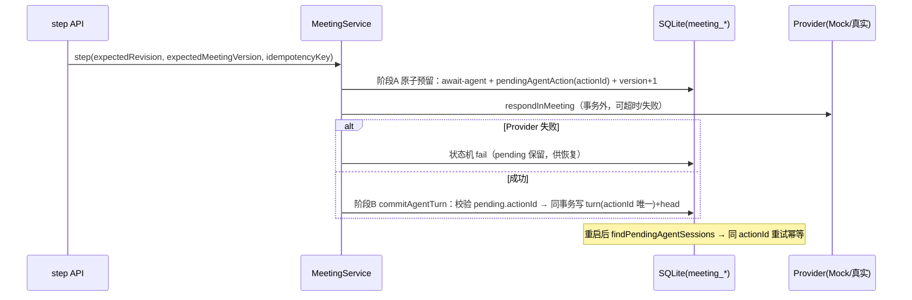
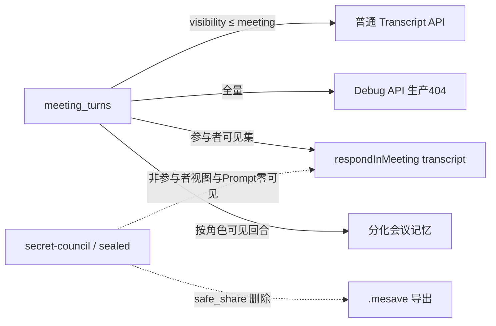

# 08 · Phase 4 实施记录：会议编排与多人物议政系统

> 决策细节见 ADR-015 ~ ADR-021；验收证据见 `docs/progress/2026-07-26-phase4-session.md`
> 与 `docs/progress/phase4-benchmark.json`。

## 1. 交付范围

```text
玩家创建会议 → 配置类型/参与者/议程 → Meeting Director（确定性）规划下一步
→ Speaker Scheduler 选择合法发言者 → Character Agent（Phase 3 全链复用）发言
→ 两阶段原子落库 Transcript → 议程推进 → 结果候选（白名单）→ 玩家裁决
→ 合法候选映射 GameCommand → StateEngine 提交 → 会议结束 → 纪要 + 分化记忆 + 泄密评估
```

不包含（Phase 5+）：政策执行引擎、规则 DSL、事件后果展开、战争/财政、多玩家、
并行 Agent 发言、Agent 自主建会。

## 2. 模块地图

| 层     | 位置                                                       | 内容                                                                                                       |
| ------ | ---------------------------------------------------------- | ---------------------------------------------------------------------------------------------------------- |
| Domain | `packages/domain/src/meeting-{runtime,agent,api}.ts`       | 富运行态/参与者/议程/回合/玩家动作(12)/事件(15)/候选/泄密/纪要/预算 + 19 个错误码 + 会议输出契约           |
| 命令   | `commands.ts` + `game-engine/src/meeting-commands.ts`      | meeting.create/start/conclude/cancel 经 StateEngine 更新最小投影；applyMutation add/remove 逐键语义        |
| 引擎   | `packages/meeting-engine`                                  | 状态机（全矩阵）、资格(13 项)、调度（确定性评分+tie-break）、Director、白名单映射、泄密评估、纪要/记忆生成 |
| 存储   | migration 003 + `save-system/src/meeting-repository.ts`    | 七张 STRICT 表、meetingVersion 乐观锁、两阶段 commitAgentTurn、投影查询、safe_share 剥离、导入导出复制     |
| Agent  | prompt-system 3 新资产 + `CharacterAgent.respondInMeeting` | 议程/Transcript 段注入（预算裁剪）、会议输出 Schema、referencedTurnIds ⊆ 可见回合                          |
| 服务   | `apps/server/src/services/meeting-service.ts`              | 编排、两阶段与恢复、玩家动作、裁决、收尾（泄密→命令→纪要→分化记忆）                                        |
| API    | `routes/meetings.ts` + `debug-meetings.ts`                 | 12 公开端点 + 3 Debug（生产 404）                                                                          |
| Web    | `features/meeting-lab/`                                    | 创建/运行/Transcript/候选裁决/泄密 Debug                                                                   |

## 3. 状态机转换矩阵（ADR-015）

```text
schedule            draft → scheduled
start-preparation   scheduled → preparing
start               preparing → in-progress
await-player        in-progress → waiting-for-player
await-agent         in-progress → waiting-for-agent
agent-completed     waiting-for-agent → in-progress
step-completed      waiting-for-player → in-progress
open-agenda         in-progress → in-progress（校验议程归属）
begin-resolution    in-progress | waiting-for-player → resolving
resolve-agenda      resolving → in-progress
pause               in-progress | waiting-* | resolving | failed → paused
resume              paused → in-progress
conclude            in-progress | resolving | waiting-for-player → concluded
cancel              draft | scheduled | preparing | paused | failed → cancelled
fail                in-progress | waiting-for-agent | resolving → failed
终态：concluded / cancelled 拒绝一切事件；每次转换 meetingVersion + 1
```

## 4. 两阶段 Agent 回合（ADR-020）



## 5. 信息边界



## 6. P4.0 遗留修复

- 记忆随存档导入导出：importer 复制 character_memories/character_conversation_turns
  （快进主键去重合并；fork 重映射 saveId + 主键前缀重写；载荷 revision 合法性校验）。
- Node 24.18.0 便携复核：check:phase3 全链 275/275 全绿；`DatabaseSync.serialize`
  移除的兼容与 ci.yml 行尾断言修复。

## 7. 质量门

`npm run check:phase4` = check:phase3 全链 + meeting-state/scheduler/recovery/
security(+memory-leak)/integration(+outcome)。CI 全 Mock、Node 24.18.0（.nvmrc）、
无 Secrets、含崩溃恢复与秘密隔离测试。`npm run benchmark:phase4` 输出 §22 基准。

## 8. 已知边界

- 分叉导入不携带会议史（记忆随 fork 复制；会议史全键重映射留待需要时实现）。
- Director 的"立场多样性"评分位默认 0（接口就绪，统计喂入留待 Phase 5 调优）。
- 泄密触发只产生 hidden 候选事件；后果展开属 Phase 5 事件引擎。
- 会议纪要为规则拼接；LLM 辅助润色（带 sourceTurnIds 校验）留待评审。
