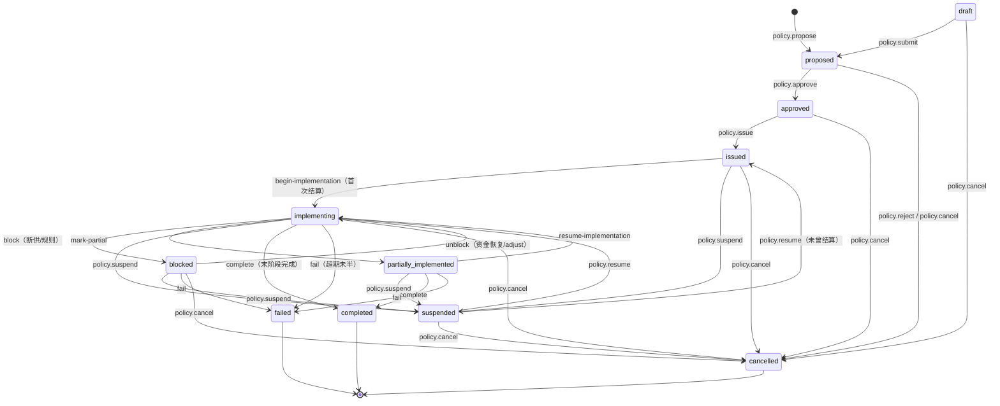
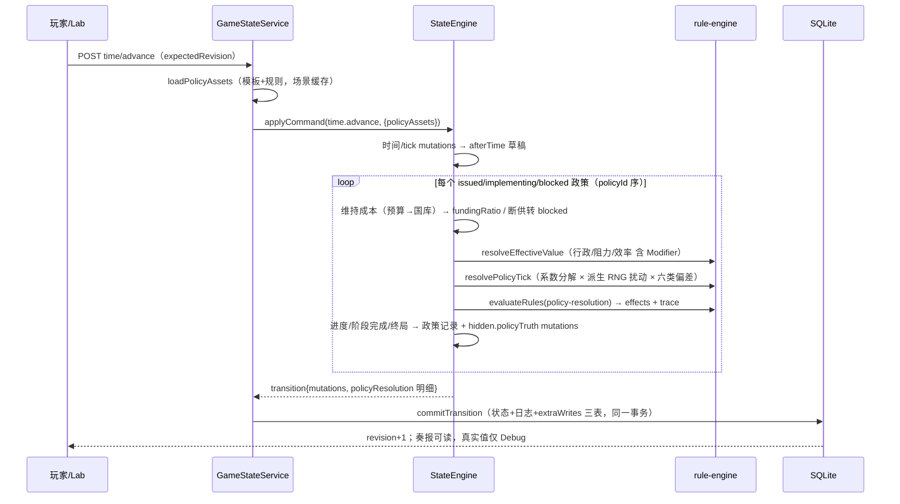
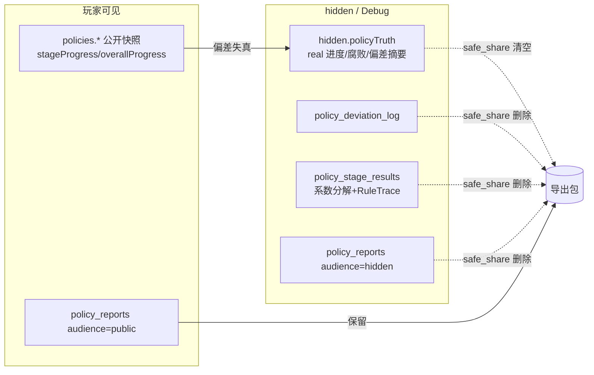

# Phase 5 实现说明：规则引擎、Modifier 与政策生命周期

Phase 5 落地数据驱动规则引擎（ADR-022）、统一 Modifier 系统（ADR-024）与政策完整
生命周期（ADR-023），并把执行结算挂接时间推进（ADR-025/026）。本文与 ADR-022~026、
`docs/03-domain-model.md` 互补，只讲结构与时序。

## 1. 底座链路

```text
会议候选（propose-policy 预览）或皇帝直诏
→ policy.propose（白名单命令，origin: meeting|direct-decree）
→ policy.approve（模板 baseImpact + policy-legality 规则；直诏承担数据驱动代价，
  可被 POLICY_LEGALITY_BLOCKED 拒批）/ policy.reject
→ policy.issue（责任机构=模板指定、负责人须任 allowedOfficeIds、启动成本预检、
  hidden.policyTruth 建档、进入 issued）
→ time.advance（同一事务）：对 issued/implementing/blocked 政策按 policyId 序结算
→ Mutation Plan 经 StateEngine 原子提交（revision+1 + StateChangeLog）
→ 明细/奏报/偏差经 commitTransition.extraWrites 同事务落 migration 004 三表
→ 玩家读公开奏报；真实值在 hidden.policyTruth（仅 Debug）
→ adjust / suspend / resume / cancel（沉没成本与合法性代价）
→ completed（完成效果 + 长期 Modifier）| failed（失败效果）| cancelled
```

## 2. 政策状态机（ADR-023）



终态不可复活；全矩阵（14 事件 × 11 态）由 `describePolicyTransitionMatrix` 导出并
在 tests/policy-lifecycle.test.ts 全量断言。

## 3. 单 tick 结算时序（ADR-025）



## 4. 奏报 / 真实信息边界



## 5. 包边界

- `packages/rule-engine`：纯函数（domain+shared 依赖；源码级禁 eval/Math.random/
  sqlite/真实时钟，依赖矩阵测试守护）；
- `packages/game-engine`：状态机 + planner + 结算编排（依赖 rule-engine，
  不依赖 llm-adapters/agent-runtime）；
- 装配在 save-system（policyAssets 缓存、extraWrites）与 server（PolicyService、
  路由、错误映射 404/409/422）。

## 6. 已知边界（Phase 5 记录）

- regions 实体未落地：regional 政策的地区效果在结算中跳过并留 note（Phase 6）；
- 场景内户部尚书虚悬：涉户部模板允许内阁首辅督办（数据 notes 已标注）；
- 单政策单 tick 约 1.4ms（目标 <1ms）：剩余成本在全量 Zod 双 parse 与哈希链，
  Phase 12 优化（本阶段已修复 applyMutations O(n²) 克隆，20 政策长程 5×提速）；
- 多日推进（days>1）为单次结算线性缩放（维持成本×days、进度×days），
  偏差 roll 每次结算一轮——逐日推进为最精细粒度。
